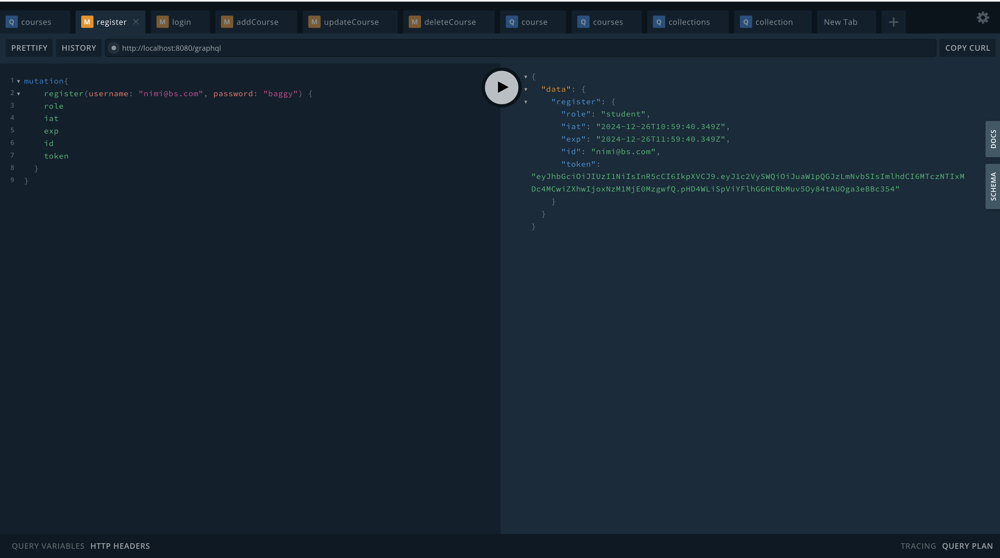
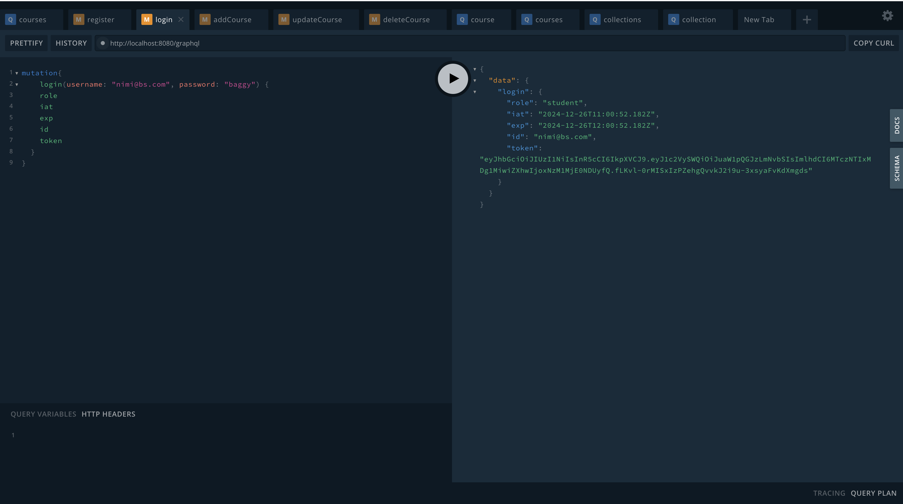
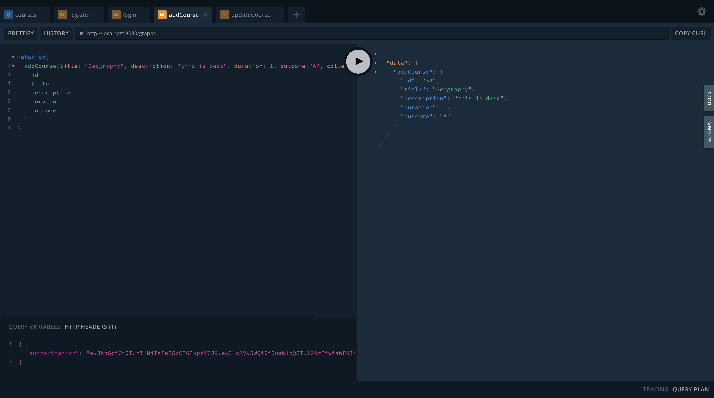
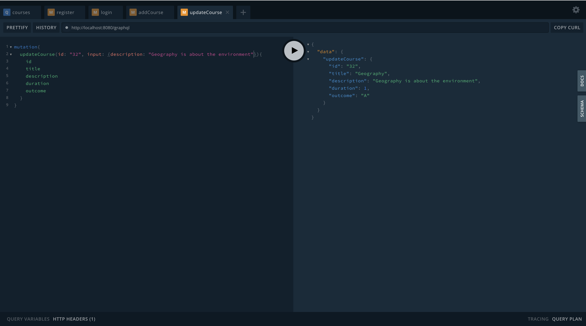
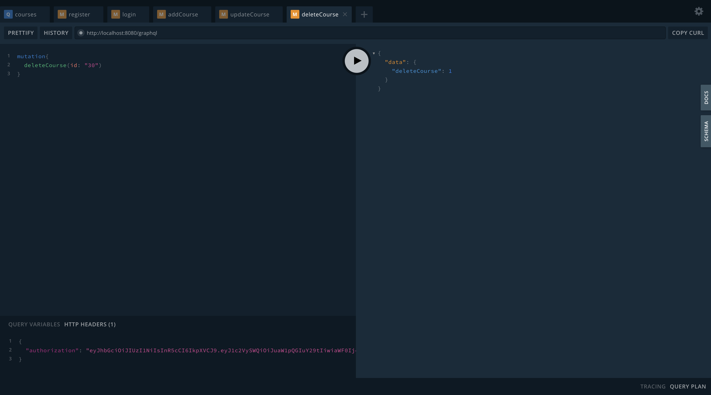
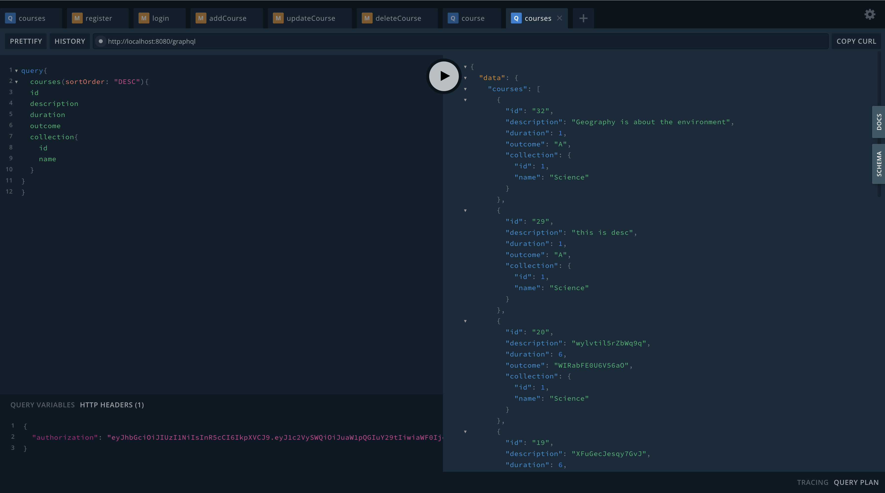
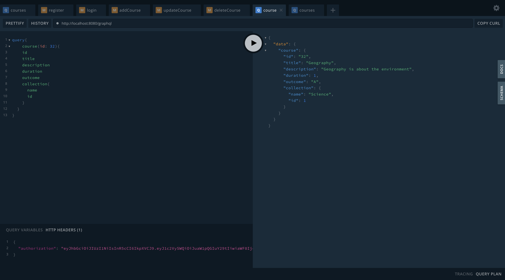
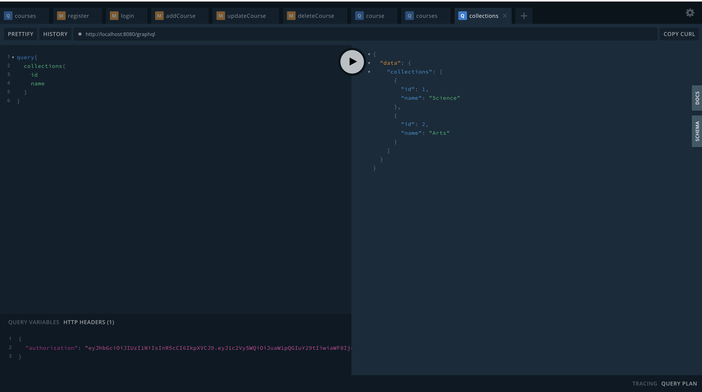
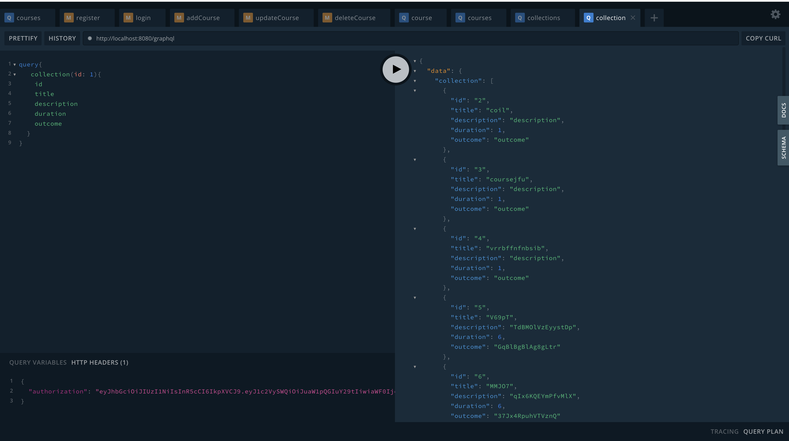

# Open Study College Exercise

I have completed the exercise and fulfilled the obligations as well as the bonus section
A good deal of evidence can be seen in the github [actions](https://github.com/Jesulonimi21/open-study-college-exercise/actions/runs/12503568143) where i run the following tests as well as the screenshots in the last section
```
PASS tests/test.ts (32.737 s)
  test open study group asessment
    ✓ Can Register User (561 ms)
    ✓ Registered User Can Login (283 ms)
    ✓ Cannot fetch course without authorization token (181 ms)
    ✓ Logged in user can fetch courses with authorization (226 ms)
    ✓ Cannot fetch all courses without authorization (113 ms)
    ✓ can fetch all courses with authorization (219 ms)
    ✓ Cannot Add Courses without authorization (115 ms)
    ✓ Can Add Courses with authorization (547 ms)
    ✓ Cannot fetch collection without authorization (116 ms)
    ✓ Can fetch collection with authorization (223 ms)
    ✓ Cannot fetch single collection without authorization (113 ms)
    ✓ Can fetch single collection with authorization (327 ms)
    ✓ Cannot update course without authorization (131 ms)
    ✓ Can update course with authorization (446 ms)
    ✓ Cannot delete course without Authorization (114 ms)
    ✓ Can delete course with Authorization (230 ms)

Test Suites: 1 passed, 1 total
Tests:       16 passed, 16 total
Snapshots:   0 total
Time:        32.775 s
Ran all test suites.
```


## Bonus
- Added a createAdmin and loginAdmin 
- Admin is the only one that can update a course when the env var ONLY_ADMIN is set to true
- Added Linting and Formatting to the code
- Added continuous integration with github actions for checking linting, formatting and running tests in CI, can be viewed on the repo [here](https://github.com/Jesulonimi21/open-study-college-exercise/actions/runs/12502563535)
- Used a production live database 
- Added end to end tests in jest to test the required functionalities
- Added a dockerfile so that the code could be run in a container by any developer without having to configure local software, this image could also be put in a container service like AWS ECS or DigitalOcean apps to host the backend


## Performance Optimization
- used the `info` from `GraphQLResolveInfo` to reduce query cost on the backend by making sure that we were only fetching the columns that were requested in the graphql query from the database  on the backend, hence making database queries faster since unnecessary columns were not fetched from the db as seen [here](https://github.com/Jesulonimi21/open-study-college-exercise/blob/7a00cd0ff48b173792c626dc15d9fcc999fed6ee/src/resolvers/index.ts#L77).
- Batching and Caching using the DataLoader Library, this makes sure i'm not making two identical database calls within a single request so this stores the keys of certain requests previously made, for example, if we want to fetch all courses as well as the collection they belong to, the moment this has fetched a particular collection for a course from the db using the collection id, it would cache that result such that the second time another course decides to fetch that same collection using its collection id, it would not fetch the collection again from the db, but instead return the previously cached collection. By doing this, it batches multiple database requests into a single query to make sure not two database requests are the same, i used it [here](https://github.com/Jesulonimi21/open-study-college-exercise/blob/7a00cd0ff48b173792c626dc15d9fcc999fed6ee/src/index.ts#L20) and [here](https://github.com/Jesulonimi21/open-study-college-exercise/blob/7a00cd0ff48b173792c626dc15d9fcc999fed6ee/src/resolvers/index.ts#L294).


## What Would I have done better if i had more time
 - I would have made sure to not just stop at Continuous Integration but also add continuous deployment so that the latest version of our backend could be hosted on an hosting service the moment a PR is approved
 - I would have separated the file for the resolvers and made sure that there were different files for authentication and specific queries/mutations so one file is not too long
 - I would have added all the types in the global.d.ts file instead of just some of them
 - I would have made sure to enforce DRY(Don't Repeat Yourself) principles through out the code, especially for the tests
  


## Pictorial Evidences
- register(username, password): Allows users to create a new account.


- login(username, password): Authenticates users and returns an access token (JWT).


- addCourse(input): Adds a new course to the database.


- updateCourse(id, input): Updates a course's details based on its ID.
  

- deleteCourse(id): Deletes a course from the database by its ID.


- courses(limit, sortOrder): Returns a list of courses in the database. Accepts optional parameters limit (integer) and sortOrder (enum: ASC | DESC).


- course(id): Returns the course with the specified id.


- collections: Returns a list of all course collections (categories).


- collection(id): Returns a specific collection along with all contained courses



